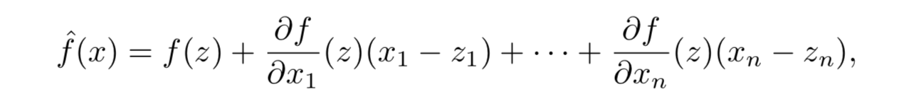
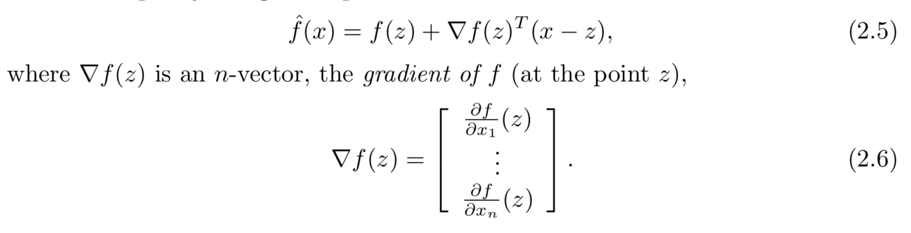
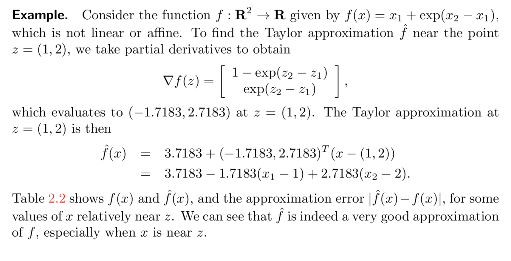

## Linear functions

#### function notation
* **f: Rn -> R** means:  f is a function that maps Rn to R, 

* f can also be interpretted as a function of n scalar arguments: 
    f(x) = f(x1,x2, ..., xn)

* e.g. 
    f(x) = x1 + x2 - x42 
    is a function f: R4-> R

#### inner product function
* suppose a is an n-vector, f(x) = aTx = a1x1, a2x2, ..., anxn 

* f can be thought of as forming a weighted sum of the elements of x 

#### superposition and linearity
* **superposition equality**: f(αx + βy) = αf(x) + βf(y)
* the inner product function satisfy the **superposition** property, thus it is **linear**. 
* superposition equality: on the left-hand side, the term αx + βy involves scalar-vector multiplication and vector addition. On the right-hand side, αf(x) + βf(y) involves ordinary scalar multiplication and scalar addition.
* if a function is linear, superposition extends to linear combinations of any number of vectors, not just two. 
* **another presentation of superposition**
    1. Homogeneity. For any n-vector x and any scalar α, f(αx) = αf(x)
    1. Additivity. For any n-vectors x and y, f(x + y) = f(x) + f(y)
* Homogeneity states that scaling the (vector) argument is the same as scaling the function value; additivity says that adding (vector) arguments is the same as adding the function values.

#### represent a linear function as inner product 
* If a function is linear, then it can be expressed as the inner product of its argument with some fixed vector.
* Suppose f is a scalar-valued function of n-vectors, and is linear, then *there is an n-vector a such that f(x) = aTx for all x*, where aTx is the **inner product representation of f**
* e.g. f(x) = f(x1e1, x2e2, ..., xnen) 
    = x1f(e1) + x2f(e2) + ... + xnf(en) 
    = aTx
    with a = (f(e1), f(e2), ... ,f(en) 

* The representation of a linear function f as f (x) = aTx is **unique**, which means that there is only one vector a for which f (x) = aTx holds for all x

#### examples 
* mean value of an n-vector: 
    f(x) = (x1 + x2 + ... + xn)/n
         = aTx with a = (1/n, ..., 1/n) = **1**/n
* maximum: 
    The maximum element of an n-vector x, f (x) = max{x1 , . . . , xn }, is not a linear function (except when n = 1).

#### affine functions 
* A linear function plus a constant is called an affine function.
* f: Rn -> R is affine iff it can be expressed as **f(x) = aTx + b**
* e.g. f(x) = 2.3 - 2x1 + 1.3x2 - x3 is affine, with b = 2.3, a = (-2, 1.3, -1)
* superposition holds for affine functions when the coefficients sum to one (i.e., when the argument is an affine combination)

## Taylor approximation
#### when to use
In many applications, scalar-valued functions of n variables, or relations between n variables and a scalar one, can be **approximated** as linear or affine functions, which are called a **model**

#### approximate affine model
* suppose that f: Rn -> R is differentiable. Let z be an n-vector. The Taylor approximation of f near the point z is the function: 

* The hat appearing over f on the left-hand side is a common notational hint that it is an approximation of the function f.

* Sometimes fˆ is written with a second vector argument, as fˆ(x;z), to show the point z at which the approximation is developed.

* fˆ is an **affine** function of x. It is sometimes called the **linear approximation** of f near z

* taylor approximation using **inner product notation** 

* example 

## Regression model
* regression is a commonly used affine function, esp. when the n-vector x represents a feature vector. 

* **DEFINITION** 
    The affine function of x given by **yˆ = xTβ + v**, where β is an n-vector and v is a scalar, is called a **regression model**. 
    *
        The entries of x are called the       regressors, and yˆ is called the    prediction, which approximate some true value y that is called the dependent value/outcome/label.
    *
        The vector β is called the weight vector or coefficient vector, and the scalar v is called the offset or intercept in the regression model
    * 
        Together, β and v are called the parameters in the regression model.

* interpreting the weight vector:
    * βi is the amount by which yˆ increases (if βi > 0) when feature i increases by one (with all other features the same).
* The offset v is the value of yˆ when all features have the value 0.

